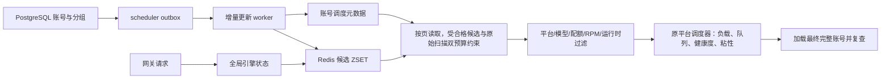
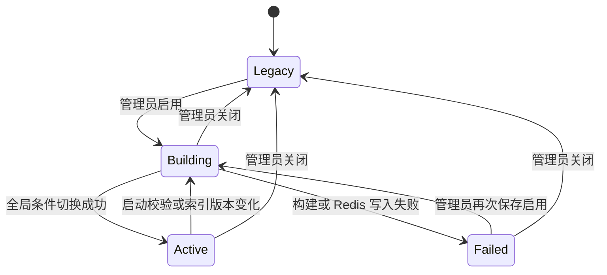

# 实验高性能调度引擎工作原理与运维说明

本文档描述已经落地的 Scheduler V2 实现。它不是发布计划，也不包含影子调度、双写验证或灰度比例。

## 1. 结论与设计约束

Scheduler V2 解决两个主要问题：

1. 大分组请求不再读取整个账号快照，只读取固定大小的有序候选窗口。
2. 单账号或批量账号变化不再重建其所在大分组，而是按账号反向索引增量更新。

本实现遵守以下硬约束：

- 管理员设置中只有一个全局开关 `scheduler_v2_enabled`，关闭时不展示 V2 参数，开启后展开候选与扫描预算。
- 默认单请求最多收集 64 个合格候选、检查 256 个原始账号；两项均可由管理员修改并对所有实例生效。
- 开关是全平台、全账号类型、全实例生效，不是 OpenAI 专用开关。
- 新旧引擎互斥运行。启用后，请求选号、账号变化、批量变化和最后使用时间更新只走 V2 分支。
- 不做影子调度，不同时运行两套选号后比较结果，不双写旧快照。
- 不做灰度，不按用户、分组、平台、实例或流量比例拆分。
- V2 缓存未就绪或 Redis 不可用时 fail closed，绝不回退旧快照或旧调度查询。
- 关闭 V2 时先清除可能过期的旧快照就绪标记，再发布 `legacy` 状态，避免重新启用旧逻辑时读到陈旧快照。

“不回退旧逻辑”特指候选获取与调度更新链路。最终选中账号的完整对象加载、并发槽获取、计费、限流记录和上游转发仍复用原有业务组件，因为它们不是旧候选调度算法。

## 2. 旧版瓶颈

旧版按 `group + platform + mode` 保存完整 bucket 快照：

- 请求先对完整 ZSET 执行 `ZRANGE 0 -1`。
- 随后对全部账号元数据执行分块 `MGET`。
- 应用层再做临时限流、模型、能力、配额、RPM、分组和运行时状态过滤。
- 账号变化通过 outbox 触发 bucket 重建；一个账号属于多个 bucket 时会重复加载和写入大分组。

设分组账号数为 `N`：

- 旧版热路径读取和反序列化复杂度为 `O(N)`。
- 旧版单账号更新的主要成本接近其相关 bucket 的 `O(N)` 重建。
- 高频 `last_used_at`、临时限流和批量账号更新会放大 Redis 流量、JSON 分配、GC 和数据库读取。

本次只读生产数据副本显示：

| 指标 | 数量 |
| --- | ---: |
| 生产账号总数 | 706,977 |
| 有分组绑定的唯一账号 | 89,062 |
| `account_groups` 绑定 | 90,780 |
| 导出的分组行 | 925 |
| 测试中有可用候选的活跃分组 | 633 |
| 最大分组 ID | 1562 |
| 最大分组绑定数 | 3,131 |

这个规模下，每个请求解析 3,131 个账号，或每次单账号变化重建 3,131 人的分组，已经不是可持续路径。

## 3. 总体架构

V2 把“稳定、可索引的排序”与“请求时、易变化的业务判断”分为两层。



第一层候选索引只放适合稳定排序的字段：

- 账号优先级；
- 最后使用时间；
- Gemini 原生 OAuth 精确平局偏好。

第二层继续执行原有动态策略：

- 模型映射与 endpoint capability；
- 临时限流、过载、过期、quota pause；
- 窗口费用、RPM、会话上限；
- OpenAI runtime block、父账号健康、渠道限制、compact、transport；
- 并发负载、等待队列、错误率、TTFT、额度余量和粘性。

这样既避免全量扫描，也不会把高频、请求相关的状态硬编码进一个全局 ZSET 分数。

## 4. 平台、账号类型与 bucket

### 4.1 当前覆盖矩阵

| 平台 | 已覆盖账号类型 |
| --- | --- |
| Anthropic | API Key、OAuth、Setup Token、Bedrock、Service Account |
| Gemini | API Key、OAuth、Service Account |
| OpenAI | API Key、OAuth |
| Antigravity | API Key、OAuth、历史 Upstream（当前新建流程落为 API Key） |
| Grok | API Key、OAuth |

候选索引没有“仅 OpenAI”判断。账号类型通常只影响平台调度器的请求兼容性，不影响索引基础结构，因此增加同平台的新账号类型通常不需要修改索引代码。

### 4.2 bucket 定义

`SchedulerBucket` 由三部分组成：

```text
group_id : platform : mode
```

模式：

- `single`：普通单平台调度。
- `mixed`：Anthropic 或 Gemini 原生账号，加上开启 `mixed_scheduling` 的 Antigravity 账号。
- `forced`：请求上下文明确指定平台。

标准模式使用真实 `group_id`。简单模式统一为 `group_id=0`。标准模式下未分组账号也使用 `group_id=0`，但请求时会再次检查账号确实未绑定其他组。

账号到 bucket 的推导是通用函数：

- 原生账号进入自身平台的 `forced` bucket。
- 账号平台与分组平台相同时进入 `single`。
- Anthropic/Gemini 原生账号进入对应 `mixed`。
- 开启混合调度的 Antigravity 账号进入所属 Anthropic/Gemini 分组的 `mixed`。

## 5. 管理员开关与状态机

### 5.1 状态

Redis 保存全局权威状态，所有应用实例在每次调度前读取：

| engine | status | 含义 |
| --- | --- | --- |
| `legacy` | `disabled` | 旧版调度生效 |
| `v2` | `building` | 已彻底切到 V2，索引正在构建 |
| `v2` | `active` | V2 索引已激活 |
| `v2` | `failed` | V2 构建失败，但仍保持 V2，禁止回退 |



关键点：进入 `v2/building` 的瞬间，后续请求已经只走 V2。系统不会先在旧版旁边“预热一套”再切换，因此不存在影子阶段。

### 5.2 启用流程

1. 管理员保存 `scheduler_v2_enabled=true`。
2. 设置写入数据库。
3. Redis 全局状态发布为 `v2/building`。
4. 后台任务获取全局 activation lock。
5. 读取已知 bucket 与当前所有默认 bucket。
6. 对缺失、损坏或索引版本过期的 bucket 构建候选索引。
7. 使用 Redis compare-and-set，仅当当前仍是 `v2/building` 时切到 `v2/active`。

管理员在构建期间关闭开关时，最后一步 compare-and-set 会失败，因此迟到的构建任务不能把系统重新改回 V2。

### 5.3 关闭流程

1. 先删除旧快照的 `ready` 和 `active` 指针。
2. 再发布 `legacy/disabled`。
3. 后续请求只走旧版。
4. 旧版第一次缓存未命中时从数据库读取并重新建立新鲜快照。

顺序不能颠倒。V2 期间旧快照没有影子维护，若先切到旧版就可能短暂读到过期数据。

### 5.4 启动、多实例与 Redis 状态丢失

- 启动时数据库设置是持久化目标，Redis 是运行时全局权威状态。
- 数据库目标为 V2 且 Redis 已是 `v2/active` 时，只复用索引版本正确且完整的 bucket。
- Redis 状态键缺失时，服务只读数据库设置并重新发布目标状态；数据库目标为 V2 时保持 fail closed，并触发受全局锁保护的索引恢复。
- 全局 activation lock 防止多实例同时做完整激活。
- 最终状态使用 compare-and-set，关闭、失败恢复和多实例启动不会互相覆盖。

### 5.5 候选与扫描预算

管理员打开开关后可设置：

- `scheduler_v2_candidate_limit`：最终交给平台动态策略的合格候选窗口；
- `scheduler_v2_scan_limit`：模型路由 ID、首批索引账号和所有扩展分页合计最多检查的原始账号数。

保存时服务校验候选上限为 1–4,096、扫描上限不小于候选上限且不超过 65,536。两个字段同时缺失的旧客户端按默认 64/256 处理；显式非法组合返回 `INVALID_SCHEDULER_V2_LIMITS`。

预算通过 Redis `MSET` 全局发布，并与 engine state 一起被各实例读取。其他实例不需要重启或重建索引即可使用新值。若 Redis 发布或引擎切换失败，数据库中的开关和两个预算会恢复到先前值，避免持久化目标与运行时状态不一致。

## 6. Redis 数据结构

### 6.1 全局状态

| Key | 类型 | 用途 |
| --- | --- | --- |
| `sched:engine` | String | `legacy` 或 `v2` |
| `sched:engine:status` | String | `disabled/building/active/failed` |
| `sched:engine:error` | String | 最近一次激活错误 |
| `sched:v2:candidate-limit` | String | 单请求合格候选上限，默认 64 |
| `sched:v2:scan-limit` | String | 单请求原始账号检查上限，默认 256 |

### 6.2 候选索引

| Key | 类型 | 用途 |
| --- | --- | --- |
| `sched:v2:cand:{bucket}` | ZSET | member=账号 ID，score=稳定候选分数 |
| `sched:v2:ready:{bucket}` | String | 当前候选分数版本 |
| `sched:v2:count:{bucket}` | String | bucket 候选数 |
| `sched:v2:buckets` | Set | V2 bucket 注册表 |
| `sched:v2:acc-buckets:{account_id}` | Set | 账号反向所属 bucket |
| `sched:lock:{bucket}` | String | 重建或增量写锁 |

候选 ZSET 本身只保存账号 ID 与数值分数。调度元数据仍使用现有 `sched:meta:{id}`，完整账号缓存使用 `sched:acc:{id}`。

### 6.3 构建与完整性

- 构建开始先把 ready 标为 `building`，读请求不会看到“新 ZSET + 旧 count”的中间状态。
- 新 ZSET 先写临时 key，再用 `RENAME` 原子替换目标 ZSET。
- 元数据先于 ready 标记写入。
- count、ready、bucket 注册和反向索引在替换后按顺序发布；ready 最后恢复为当前索引版本。
- 单账号 `ZADD/ZREM` 与 count 增减由 Lua 在同一原子操作内完成。
- ready 缺失、版本不符、count 非法、ZSET 与 count 矛盾、任一元数据缺失，都视为 cache miss，不静默跳过损坏数据。
- cache miss 只触发 V2 bucket 重建；不会调用旧快照或旧版候选查询。
- 反向索引使单账号变更只访问该账号曾经和现在所属的 bucket。

## 7. 候选分数与权重扩展

### 7.1 当前公式

分数越小越优先：

```text
score =
    clamp(priority, -9000, 9000) * 100_000_000_000
  + normalized_last_used_unix_seconds
  + gemini_native_oauth_tiebreak
```

其中：

- 优先级项绝对支配其余项，数值更小的优先级先被读取。
- 从未使用或早于 Unix epoch 的时间按 0 处理。
- 正常 `last_used_at` 使用 Unix 秒，越旧分数越小。
- 异常超远未来时间被限制在优先级权重以内。
- Gemini bucket 中，原生 Gemini 非 OAuth 在完全相同优先级和秒级 LRU 时增加 `0.25`，因此原生 OAuth 先出。
- `1e11` 在完全支配时间项的同时，使最高优先级总分仍保留 `0.25` 的 float64 精度；该公式使用索引版本 2。
- Redis 在完全相同分数时可按 member 排序，所以相同权重账号 ID 不要求与旧版相同。

### 7.2 因子注册表

`schedulerCandidateScoreFactors` 是静态索引权重的唯一注册表。每个因子实现：

```go
type SchedulerCandidateScoreFactor interface {
    Name() string
    Score(account Account, bucket SchedulerBucket) float64
}
```

`SchedulerCandidateScoreBreakdown` 暴露每个命名项，测试和诊断不需要复制公式。

### 7.3 新增静态权重

新增一个稳定权重时：

1. 确认它不是请求相关或高频变化字段。
2. 如需要，在 slim scheduler metadata allowlist 中加入来源字段。
3. 实现一个独立因子并加入 `schedulerCandidateScoreFactors`。
4. 递增 `SchedulerCandidateIndexVersion`。
5. 增加顺序、边界、全平台和旧版业务约束对比测试。

版本递增后，旧 ready 值不再匹配，bucket 会自动重建，不会继续使用旧分数。这是后续加权重只需少量修改的关键。

### 7.4 动态权重应放在哪里

负载、等待队列、错误率、TTFT、额度余量、请求模型、session sticky 等不能放进全局 ZSET：

- 它们变化频率高；
- 它们可能只对当前请求成立；
- 写回全局 ZSET 会造成更新风暴或不同请求互相污染。

这类权重继续放在平台调度器，对已经过滤出的有界候选窗口计算。新增动态权重通常只修改对应平台策略，不修改候选索引。

## 8. 请求选号流程

### 8.1 读取状态

每次进入调度先读取全局 engine：

- `legacy`：只执行旧版。
- 任意 `v2/*`：只执行 V2。
- Redis 状态丢失：按数据库持久化目标恢复，不因空 key 默认为旧版。

### 8.2 确定 bucket

根据分组、平台和是否强制平台确定 `single/mixed/forced`。请求时仍再次校验：

- 账号平台是否属于 bucket；
- 标准模式的账号是否确实属于目标组；
- 未分组 bucket 的账号是否确实无分组；
- Antigravity 是否允许混合调度。

### 8.3 模型路由优先账号

Anthropic 模型路由可能指定账号 ID。V2 会：

1. 先确认对应 bucket 索引完整；
2. 从普通账号缓存读取这些 ID；
3. 执行相同分组、平台、可调度和请求兼容性判断；
4. 将合格路由账号放入有界候选窗口；
5. 再从 ZSET 补足普通候选。

因此显式模型路由不会因为账号不在普通 ZSET 首个窗口而失效，也不能绕过业务过滤。路由账号同样计入单请求原始检查预算，避免大量显式 ID 绕过性能上限。

### 8.4 分页与过滤

V2 使用两个管理员参数控制单请求最坏成本：

- `scheduler_v2_candidate_limit`：最多收集多少个真正符合当前请求的账号，默认 64，合法范围 1–4,096；
- `scheduler_v2_scan_limit`：最多检查多少个原始账号，包含模型路由 ID 和所有后续分页，默认 256，合法范围为候选上限到 65,536。

读取持续到以下任一条件成立：

- 收集到 `candidate_limit` 个合格候选；
- 已检查 `scan_limit` 个原始账号；
- 到达 ZSET 尾部。

窗口费用和 RPM 不逐账号访问存储。每一页先批量读取 window-cost/RPM 状态，再对该页做判断；整页不可用且尚有扫描预算时继续下一页。最终合格窗口进入平台调度器后仍会执行原有批量预取与复查。

分页是必要的。首批账号可能全部因为下列原因被过滤：

- 已在本次重试排除列表；
- 临时限流、过载、过期或手工暂停；
- 模型映射不兼容；
- endpoint capability 或 transport 不兼容；
- compact 模型不可用；
- OpenAI runtime block 或 shadow parent 不健康；
- 渠道上游模型限制；
- 窗口费用、quota 或 RPM 不可用；
- 分组或混合调度条件不符。

过滤失败不会直接返回“无账号”，而是在剩余扫描预算内继续读取后续页。到达扫描上限后即停止，绝不为了找到账号退回整组扫描。

推荐值：

| 账号池与运行特征 | 合格候选上限 | 原始扫描上限 |
| --- | ---: | ---: |
| 不超过 100 个账号 | 32 | 128 |
| 101–1,000 个账号，常规过滤率 | 64 | 256 |
| 千级大池或动态权重较多 | 96–128 | 512 |
| 超过半数账号经常因限流、排除或模型不兼容被过滤 | 96–128 | 1,024 |

一般先把扫描上限设为候选上限的 2–4 倍。提高候选上限会增加后续负载、队列、健康度和粘性计算成本；提高扫描上限会增加 Redis 分页与元数据反序列化成本。两项保存后立即生效，不需要重建候选索引。

### 8.5 平台策略与最终复查

收集到的候选交给原平台调度器：

- 通用 Anthropic/Gemini/Antigravity 路径保留优先级、LRU、OAuth 偏好、负载、会话和等待策略。
- OpenAI/Grok 路径保留 endpoint capability、transport、advanced scheduler、粘性、subscription pool、load/queue/error/TTFT/quota 等策略。
- 选中 slim metadata 后再加载完整账号。
- 原有并发槽、session limit 和最终数据库状态复查仍生效。

热路径复杂度从对整个大组做反序列化和过滤，变为最多对 `scan_limit` 个原始账号过滤、对 `candidate_limit` 个合格账号做动态排序。读取和内存上界由管理员配置明确控制。

## 9. 更新流程

### 9.1 outbox 路由

V2 复用已有 scheduler outbox 的事务后事件：

- `account_changed`
- `account_groups_changed`
- `account_bulk_changed`
- `account_last_used`
- `group_changed`
- `full_rebuild`

处理每个事件时先读取全局 engine，再只进入对应引擎分支。V2 不调用 `SetSnapshot` 或旧版 `UpdateLastUsed`。

### 9.2 单账号变化

1. 按 ID 从数据库读取最新账号。
2. 根据最新平台、分组和 mixed 设置计算新 bucket 集合。
3. 从 `sched:v2:acc-buckets:{id}` 读取旧 bucket 集合。
4. 对旧集合与新集合的并集按稳定顺序逐 bucket 加锁。
5. 在新 bucket 中 `ZADD` 或更新 score。
6. 从不再所属的 bucket `ZREM`。
7. 增量修正 count。
8. 重写反向索引与最新账号元数据。

成本主要与该账号的旧、新 bucket 数量相关，而不是与大组账号数相关。

### 9.3 批量账号变化

批量事件一次从数据库读取账号列表，然后逐账号执行同一增量替换。数据库中已不存在的 ID 执行定向删除。它不会把所有受影响组重建一遍。

### 9.4 删除

删除事件通过反向索引找到全部 bucket，逐个 `ZREM` 并修正 count，最后删除反向索引与账号缓存。

### 9.5 最后使用时间

`account_last_used` 只更新账号元数据，并对反向索引中的 bucket 执行 `ZADD XX` 更新 score。无需重建分组。

outbox 的时间精度是 Unix 秒，与 V2 LRU 分数一致。

### 9.6 临时不可用状态

候选索引保留“潜在可用账号”，条件是：

- 账号状态为 active；
- `schedulable=true`。

`RateLimitResetAt`、`OverloadUntil`、`TempUnschedulableUntil` 和可自动恢复的过期条件在请求时判断。这样临时状态到期后账号会自动恢复，无需额外的定时“重新加回索引”队列。

永久 inactive、手工 `schedulable=false`、平台/分组变化仍通过账号事件从相关 bucket 增删。

### 9.7 分组变化与全量修复

- 分组配置变化只重建目标 group 的平台/mode bucket，用于同时清理旧平台归属并建立新归属。
- V2 周期性全量重建最短间隔为 6 小时，避免沿用旧版高频全量重建造成数据库压力。
- outbox lag 连续超过阈值或 backlog 超过行数阈值时，可立即触发全量修复。
- 管理员启用、进程启动校验、Redis 状态恢复、索引版本变化或 bucket 损坏也会定向或全量重建。

## 10. 并发、一致性与失败行为

### 10.1 bucket 锁

- V2 完整 bucket 重建锁 TTL 为 3 分钟，单次数据库构建上下文上限 2 分钟。
- 单账号增量更新对相关 bucket 使用 30 秒锁，并等待持锁者完成。
- 多 bucket 增量操作按 bucket 字符串排序，避免不同账号更新形成不稳定锁顺序。
- 若另一个实例正在构建同一 bucket，调用方等待 ready，而不是把“未获得锁”误判为构建成功。

### 10.2 重建与增量事件竞争

完整重建持有 bucket 锁。账号事件等待锁后重新发布最新 score；事件末尾再次写账号元数据，避免较早开始的重建覆盖较新的数据库快照。

候选元数据缺失时，请求不会忽略该账号继续选号，而是将 bucket 判为不完整并重建。这使删除、进程崩溃或 Redis 部分写入最终都能自愈。

### 10.3 outbox 水位

- 只有整个拉取批次处理成功后才推进 watermark。
- watermark 写入失败会重试。
- 消费成功后在清理锁保护下分批删除已消费 outbox 行。
- 任一事件失败时停止当前批次，不越过失败事件。
- 同一 poll 批次对旧版 group rebuild 做去重；V2 账号事件本身是定向更新。

### 10.4 fail closed

在 `v2/building`、`v2/active` 或 `v2/failed` 下：

- Redis 读取错误返回 scheduler cache unavailable；
- bucket 未就绪尝试 V2 重建并等待；
- 构建失败返回 scheduler cache not ready；
- 不读取旧 `sched:ready/sched:active/sched:*:v*` 快照；
- 不执行旧版候选数据库 fallback。

如果运行时切换在数据库设置已保存后失败，服务会把 `scheduler_v2_enabled` 回滚到切换前值，避免重启后意外启用不同引擎。

## 11. 新旧业务语义

### 11.1 必须一致的约束

新旧实际选中账号都必须满足：

- 账号 active、可调度、未过期且不在临时阻断期；
- 属于正确分组、平台和调度模式；
- 支持请求模型、能力、compact 和 transport；
- 满足 quota、窗口费用、RPM、渠道和父账号健康规则；
- 不在当前重试排除集合；
- 优先级较小者优先；
- 同优先级下遵守 LRU 和平台特定偏好；
- 最终完整账号与并发状态复查通过。

### 11.2 允许不同的结果

以下差异是预期行为：

- 完全相同 score 的账号由 Redis member 顺序决定，旧版可能随机打散。
- V2 的 LRU 索引精度为秒；同一秒内账号视为同一静态权重。
- V2 先在管理员配置的扫描预算内取得有界合格候选，再计算动态负载权重；旧版可能对整个组计算。
- 同优先级、同 LRU、同业务状态下，新旧账号 ID 不要求一致。

“结果可不同”不表示可以违反业务规则。测试分别验证最小优先级、LRU、Gemini OAuth 偏好、模型与能力过滤、临时状态、分组隔离和平台动态策略。

有界窗口是本方案明确的性能换取：动态负载权重在窗口内严格执行，但不承诺对 3,131 个账号做全局动态最优搜索；否则无法消除大组 `O(N)` 热路径。

## 12. 测试与生产数据副本

### 12.1 远端数据读取纪律

生产参考数据来自生产环境 PostgreSQL 容器；服务器连接信息和容器标识不写入仓库。

本次只执行了容器 inspect、数据库 schema/统计查询和 `SELECT/COPY TO STDOUT`。没有在服务器或容器内创建、修改、删除任何文件或数据，也没有对生产数据库执行测试。

CSV 由标准输出直接落到本地忽略目录 `.cache/scheduler-fixture`。只保留调度测试需要的非敏感字段：

- 账号 ID、平台、类型、优先级、状态、可调度标记、调度时间字段；
- 分组 ID、平台、状态；
- 账号 ID 与分组 ID 绑定。

没有导出账号名称、凭据、代理、用户或请求内容。

本地副本 SHA-256：

| 文件 | SHA-256 |
| --- | --- |
| `accounts.csv` | `B4F6D66685DF7C1C1D1143991AD3F8C20DBFF1EB2FFA58FDD24A1920F3F63D6E` |
| `account_groups.csv` | `D23452E925A2423A6E4EBF2939481663DD18CB71CA22980EF96DC53B7A681CE8` |
| `groups.csv` | `124EC43947324183B6465213F06A119829585C84828523FDB314B64EEC3904F2` |

### 12.2 场景覆盖

| 类别 | 覆盖内容 |
| --- | --- |
| 引擎互斥 | V2 不读旧快照、不走旧 DB fallback；关闭先失效旧快照 |
| 多实例状态 | compare-and-set、迟到激活不能覆盖关闭、Redis 状态丢失恢复 |
| 索引 | 空 bucket、分页、缺元数据、版本不匹配、count、反向索引 |
| 更新 | 账号新增/修改/移组/禁用/删除、批量变化、last-used score 更新 |
| 请求过滤 | 排除列表、临时阻断、模型不兼容窗口、后续页可用账号 |
| 请求预算 | 默认 64/256、候选截断、扫描到 256 停止、动态修改立即生效、非法组合拒绝 |
| 多实例预算 | Redis 全局发布、其他实例随 engine-state 读取同步、发布失败回滚数据库值 |
| 混合调度 | Anthropic/Gemini 与 Antigravity mixed |
| 权重 | 优先级支配 LRU、never-used、Gemini OAuth、异常时间与优先级 |
| 平台/类型 | 当前 5 个平台及表 4.1 的全部账号类型 |
| 新旧实选 | 633 个真实分组逐组调用通用网关或 OpenAI-compatible 网关的旧版、V2 实际选号并校验业务权重 |
| 真实副本 | 89,062 个分组账号、90,780 条绑定、633 个活跃可用分组、最大组 3,131 |
| 前端 | 开关显示、状态文案、保存 payload、类型检查、Lint、生产构建 |

真实副本测试不要求新旧账号 ID 相同，但对每个被验证分组检查：

- 选中账号属于最小优先级集合；
- 若最小优先级中有 never-used 账号，选中账号也必须 never-used；
- 否则不得选择比同优先级其他账号更新的 `last_used_at`。

### 12.3 性能基准

环境：WSL Linux 文件系统、Go 1.26.5、进程内 miniredis、5 次迭代、`benchmem`，分组大小固定为真实最大组 3,131。该结果用于比较算法和分配量，不等同于真实网络 Redis/PostgreSQL 的绝对延迟。读基准直接比较 `GetSnapshot` 与 `GetCandidatePage`，不包含实际请求入口额外的一次小型 engine-state `MGET`。

| 操作 | 时间/次 | 内存/次 | 分配/次 |
| --- | ---: | ---: | ---: |
| 旧版读取完整 3,131 快照 | 47.457 ms | 9,389,979 B | 75,708 |
| V2 读取 Top 64 | 2.008 ms | 331,632 B | 1,636 |
| 旧版更新时重建 3,131 分组 | 168.574 ms | 26,754,833 B | 202,060 |
| V2 更新单账号 | 1.396 ms | 225,932 B | 1,100 |

相对结果：

- 大组读取约快 23.6 倍；
- 单账号更新约快 120.8 倍；
- 读取内存约降 28.3 倍；
- 单账号更新内存约降 118.4 倍。

### 12.4 可复现命令

按项目约束，应先把代码复制到 WSL 文件系统再编译：

```bash
cd /home/ubuntu-24/sub2api-codex/backend
go test ./...
go test -tags=unit ./...
go test ./internal/service -run Scheduler -count=1
go test ./internal/repository -run SchedulerCacheV2 -count=1
SCHEDULER_FIXTURE_DIR=/home/ubuntu-24/sub2api-codex/.cache/scheduler-fixture \
  go test -tags=schedulerfixture ./internal/service \
  -run SchedulerProductionFixture -count=1 -v
go test ./internal/repository -run '^$' \
  -bench 'SchedulerCacheLargeGroup' -benchtime=5x -benchmem
```

前端：

```bash
cd /home/ubuntu-24/sub2api-codex/frontend
pnpm --ignore-workspace exec vitest run src/views/admin/__tests__/SettingsView.spec.ts
pnpm --ignore-workspace run typecheck
pnpm --ignore-workspace run lint:check
pnpm --ignore-workspace run build
```

## 13. 运维操作

### 13.1 启用

1. 打开管理员设置页的“实验高性能调度引擎”。
2. 打开开关，按账号池规模确认展开后的候选上限与扫描上限，然后保存设置。
3. 状态会从“正在构建索引”变为“新版已启用”。
4. 构建期间流量已经只使用 V2，不存在灰度比例或旧版影子结果。

可观察日志：

- `scheduler_v2_rebuild_ok`
- `scheduler_v2_activated`
- `scheduler_v2_activation_failed`
- `[SchedulerV2] rebuild failed`
- `[SchedulerV2] cache write failed`

### 13.2 失败

状态为“新版启动失败”时：

- 页面显示最近错误；
- 请求不会回退旧调度；
- 修复 Redis 或数据库问题后，再次保存启用状态会重试；
- outbox lag/backlog 或周期全量重建也可将成功完成的 V2 恢复为 active。

不要通过手工改某个实例的内存、只删部分 Redis key 或按实例重启来模拟灰度。开关与 Redis 全局状态才是唯一切换入口。

### 13.3 关闭

关闭开关并保存即可。服务会先失效旧快照再发布 legacy 状态。关闭不是灰度回滚；所有实例在读取到全局状态后都只使用旧版。

### 13.4 排查顺序

1. 查看管理员返回的 `scheduler_v2_status` 和 `scheduler_v2_error`。
2. 检查 `sched:engine*`、`sched:v2:candidate-limit` 和 `sched:v2:scan-limit` 是否一致。
3. 检查目标 bucket 的 `ready` 是否等于当前 `SchedulerCandidateIndexVersion`。
4. 检查 count、ZSET 长度和元数据是否完整。
5. 检查 account reverse bucket set。
6. 查看 outbox watermark、lag 和 backlog。
7. 查看 bucket lock 是否在 TTL 内由构建任务持有。
8. 修复根因后重试启用或触发明确的 full rebuild。

## 14. 扩展指南

### 14.1 新账号类型

若新类型属于现有平台且沿用现有模型/能力判断：

- 通常无需修改候选索引；
- 在平台兼容性逻辑和测试矩阵增加类型；
- 确认 slim metadata 包含其请求过滤所需字段。

### 14.2 新平台

1. 定义并校验平台常量。
2. 在默认 bucket 与 group rebuild 平台列表登记。
3. 定义 `single/mixed/forced` 需求。
4. 在平台调度器提供请求 predicate。
5. 加入账号事件 bucket 推导。
6. 增加类型矩阵、实际选号、更新和大组测试。

### 14.3 新静态权重

按 7.3 节修改因子注册表、metadata 和索引版本。不要把新因子散落在 Redis repository、请求 handler 和不同平台服务中重复实现。

### 14.4 新请求级规则

通过 `withSchedulerCandidatePredicate` 组合过滤器，或在对应平台调度器中增加动态 score。规则必须同时覆盖：

- 普通候选；
- 模型路由优先 ID；
- sticky/previous-response 候选；
- 最终完整账号复查。

## 15. 已知边界与取舍

- V2 依赖 Redis 提供全局状态和候选索引。Redis 不可用时选择 fail closed，这是“不回退旧调度”的直接代价。
- 动态权重只在 `candidate_limit` 个合格静态候选内求解，不承诺全组动态最优；这是消除大组 `O(N)` 热路径的必要边界。
- 到达 `scan_limit` 后即使后续还有可用账号也会停止；高过滤率账号池应按 8.4 节提高扫描预算，而不是取消上界。
- 首次启用、索引版本变化、分组策略变化和灾难恢复仍需读取数据库并构建 bucket；这些是冷路径。
- 分组平台变化需要重建该组多个平台/mode bucket，以清除旧归属，成本高于单账号增量更新，但不会扩散到其他组。
- LRU 索引采用秒级精度，与 scheduler outbox 的 `last_used` payload 一致。
- V2 期间不会维护旧快照，因此关闭时必然先失效旧快照，旧版首个请求可能承担一次数据库重建。
- miniredis 基准反映相对算法成本；上线容量评估仍应结合真实 Redis RTT、PostgreSQL 查询时间、实例数和请求并发。

这些取舍是显式设计，不应通过偷偷回退旧调度、双写旧快照、影子选号或流量灰度绕过。
